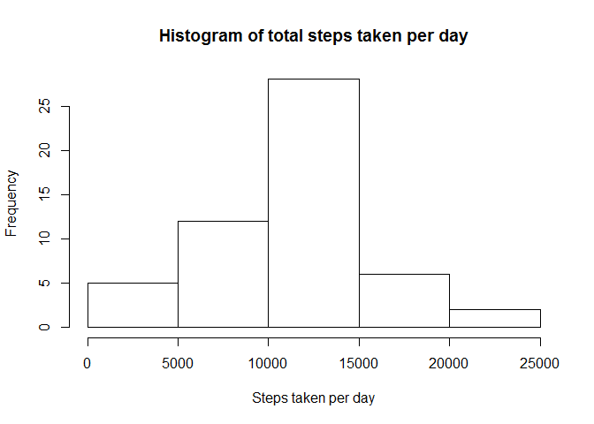
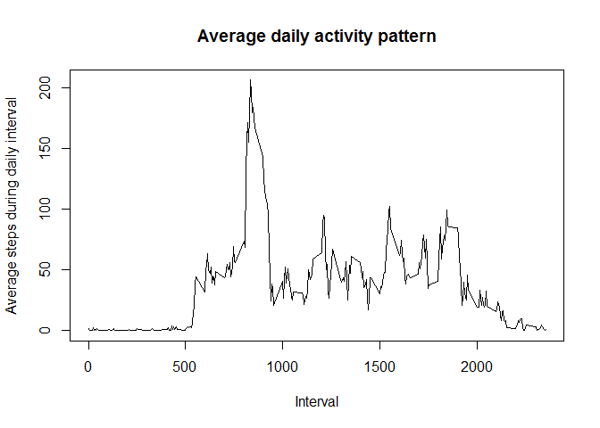
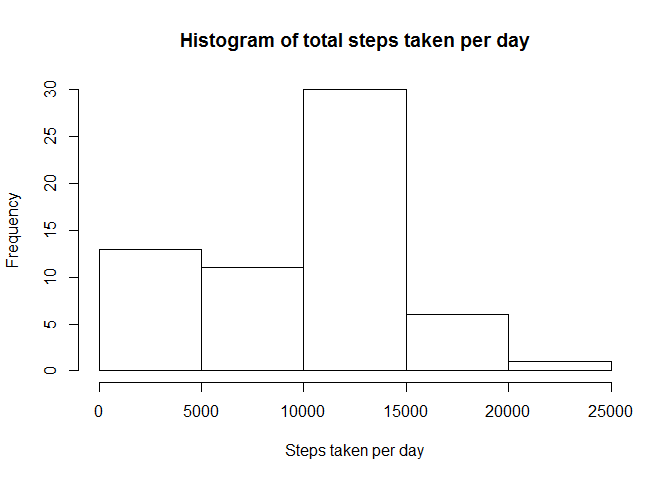
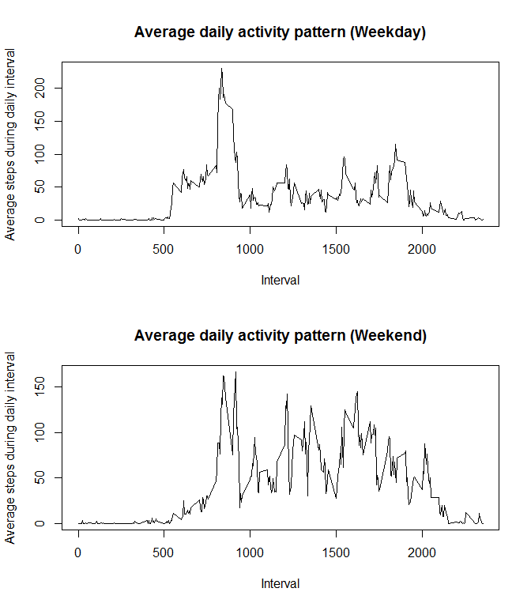
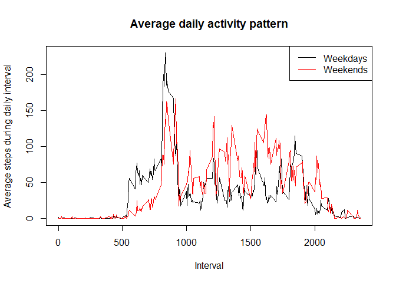

# Reproducible Research: Peer Assessment 1

This .Rmd file sets out the R programming code used to analyse the number of steps
taken over 5-minute intervals, and shows the results.

## Loading and preprocessing the data

First, the data is read using the read.csv() function, which relies on the unz() function
to unzip the .csv file.


```r
raw_data <- read.csv(unz("activity.zip","activity.csv"))

head(raw_data)
```

```
##   steps       date interval
## 1    NA 2012-10-01        0
## 2    NA 2012-10-01        5
## 3    NA 2012-10-01       10
## 4    NA 2012-10-01       15
## 5    NA 2012-10-01       20
## 6    NA 2012-10-01       25
```

Since the date column was in a factor format, the as.Date() function was used to convert
the values inito dates.

Subsequently, NA values were removed from the data using the is.na() function.


```r
# Convert dates from factor into date format
raw_data$date2 <- as.Date(raw_data$date, format = "%Y-%m-%d")

# For part 1, ignore the NA values
data <- raw_data[is.na(raw_data$steps) == FALSE,]

head(data)
```

```
##     steps       date interval      date2
## 289     0 2012-10-02        0 2012-10-02
## 290     0 2012-10-02        5 2012-10-02
## 291     0 2012-10-02       10 2012-10-02
## 292     0 2012-10-02       15 2012-10-02
## 293     0 2012-10-02       20 2012-10-02
## 294     0 2012-10-02       25 2012-10-02
```

## What is mean total number of steps taken per day?

The unique() function was used to obatain a list of dates in the sample, then the totals for
each day were calculated using a for loop.


```r
#get unique dates
dates <- unique(data$date2)

#Calculate the total for each day

totals <- rep(0, length(dates))
date_index <- c(1:length(dates))
total_per_day <- data.frame(date_index,dates, totals)

for(i in 1:length(dates)){
  
  total_per_day$totals[i] <- sum(data$steps[data$date2 == dates[i]])
  
}
```

Next, the histogram was created and the mean and median values were calculated.


```r
#Now create histogram
hist(total_per_day$totals, main = "Histogram of total steps taken per day",
     xlab = "Steps taken per day", ylab = "Frequency")
```

 

```r
mean_steps <- mean(total_per_day$totals)
median_steps <- median(total_per_day$totals)

print(paste("The mean total number of steps taken per day is ", mean_steps, "."))
```

```
## [1] "The mean total number of steps taken per day is  10766.1886792453 ."
```

```r
print(paste("The median total number of steps taken per day is ", median_steps, "."))
```

```
## [1] "The median total number of steps taken per day is  10765 ."
```

### Mean and median number of steps taken each day
As seen from the above results, the mean is **10766** while the median is **10765**.

## What is the average daily activity pattern?

To find the average daily activity pattern, the unique() function was once again used, 
this time to identify the unique intervals in the dataset. A similar for loop then
calculated the mean number of steps over each interval.


```r
#Now create plot of average daily pattern

#Note: take unique of raw_data since we want the NAs to show zero
intervals <- unique(raw_data$interval)  
average_interval <- rep(0, length(intervals))

for(i in 1:length(intervals)){
  
  average_interval[i] <- mean(data$steps[data$interval == intervals[i]])
}
```

The following code plots the daily activity pattern and calculates the interval with the
maximum number of average steps. Note that since the smallest interval number is 0, it is
assumed that the interval values represent the starting point. As such, the interval is reported as the max to max+5.

```r
plot(intervals, average_interval, type = "l", main = "Average daily activity pattern",
     xlab = "Interval", ylab = "Average steps during daily interval")
```

 

```r
max_interval <- intervals[average_interval == max(average_interval)]

print(paste("The 5-minute interval with the maximum number of average steps is ",
            max_interval, "to", max_interval+5, "."))
```

```
## [1] "The 5-minute interval with the maximum number of average steps is  835 to 840 ."
```

### Interval with maximum number of steps

From the above results, the 5-minute interval with the maximum number of average steps is 
**835** to 840, which is approximately the time that people prepare to leave for work. Note once again that the code returns "**835**", which is interpreted as the start of the interval.

## Imputing missing values

### Strategy for imputing missing values
The missing values are populated using the mean for that 5-minute interval, calculated over
all days. As shown in the code below, there were 2304 missing values.


```r
#Part 2: imputing missing values

#Find total missing values
missing_values <- sum(is.na(raw_data$steps))
print(paste("The total number of missing values is ", missing_values, "."))
```

```
## [1] "The total number of missing values is  2304 ."
```

A for loop was used to replace NA values with the mean for that 5-minute interval, and
then another loop was used to calculate the total for each day.


```r
#Fill in missing values with mean for that 5-minute interval

raw_data$stepsna <- raw_data$steps
for(i in 1:length(raw_data$stepsna)){
  
  if(is.na(raw_data$stepsna[i])){
    
    raw_data$stepsna[i] <- average_interval[intervals == raw_data$interval[i]]
    
  }
  
}

#Calculate the total for each day

datesna <- unique(raw_data$date2)
totalsna <- rep(0, length(datesna))
date_indexna <- c(1:length(datesna))
total_per_dayna <- data.frame(date_indexna,datesna, totalsna)

total_per_day_na <- data.frame(date_indexna, datesna, totalsna)

for(i in 1:length(dates)){
  
  total_per_day_na$totals[i] <- sum(raw_data$stepsna[raw_data$date2 == datesna[i]])
  
}
```

The following code creates the histogram of the total steps taken per day, and then
calculates the new mean and median number of steps after the NA values have been replaced
with the mean over their respective 5-minute intervals.


```r
#Now create histogram
hist(total_per_day_na$totals, main = "Histogram of total steps taken per day",
     xlab = "Steps taken per day", ylab = "Frequency")
```

 

```r
mean_steps_na <- mean(total_per_day_na$totals)
median_steps_na <- median(total_per_day_na$totals)

print(paste("The mean total number of steps taken per day is ", mean_steps_na, 
      ", using the dataset with imputed missing values."))
```

```
## [1] "The mean total number of steps taken per day is  9121.7593566347 , using the dataset with imputed missing values."
```

```r
print(paste("The median total number of steps taken per day is ", median_steps_na, 
      ", using the dataset with imputed missing values."))
```

```
## [1] "The median total number of steps taken per day is  10571 , using the dataset with imputed missing values."
```

### New mean and median total number of steps taken per day

The above results show that the new mean and median total number of steps taken per day
are **9122** and **10571** respectively. These estimates are in contrast to the estimates of **10766** and **10765** reported when the NA values are simply excluded. Thus, accounting for the NA values causes the average total steps per day to decrease.

This can also be seen by comparing the histograms, since the it is clear that the histogram
with the NA values accounted for results in an increase in frequency in the smaller histogram intervals and a decrease in the larger histogram intervals.

## Are there differences in activity patterns between weekdays and weekends?

The following code replaces "Saturday" and "Sunday" with "Weekend", while all other
days are replaced with "Weekday". The new column is then converted into factor class.


```r
#Part 3: find differences between weekdays and weekends
#First find whether the day is a weekday or weekend

days <- weekdays(raw_data$date2)

days[days == "Saturday" | days == "Sunday"] <- "Weekend"
days[days != "Weekend"] <- "Weekday"
days <- factor(days)

raw_data3 <- data.frame(raw_data, days)
```

The interval patterns are then calculated separately for weekdays and weekends using
a single for loop:


```r
#Find interval patterns for weekdays and weekends
average_interval_weekday <- rep(0, length(intervals))
average_interval_weekend <- rep(0, length(intervals))

for(i in 1:length(intervals)){
  
  average_interval_weekday[i] <- mean(raw_data3$stepsna[raw_data3$interval == intervals[i] &
                                                   raw_data3$days == "Weekday"])
  average_interval_weekend[i] <- mean(raw_data3$stepsna[raw_data3$interval == intervals[i] &
                                                   raw_data3$days == "Weekend"])
}
```

Finally, both the weekday and weekend series are plotted. The first figure shows the two
series on separate plots, while the second shows them on the same plot. 


```r
par(mfrow = c(2,1))
plot(intervals, average_interval_weekday, type = "l", 
     main = "Average daily activity pattern (Weekday)",
     xlab = "Interval", ylab = "Average steps during daily interval")
plot(intervals, average_interval_weekend, type = "l", 
     main = "Average daily activity pattern (Weekend)",
     xlab = "Interval", ylab = "Average steps during daily interval")
```

 


```r
par(mfrow = c(1,1))
plot(intervals, average_interval_weekday, type = "l", 
     main = "Average daily activity pattern",
     xlab = "Interval", ylab = "Average steps during daily interval")

lines(intervals, average_interval_weekend, col = "red")
legend("topright", c("Weekdays", "Weekends"), col = c("black","red"), lty = c(1,1), bty = "y")
```

 

It can be seen from the two charts above that there is more activity in the early mornings during weekdays, possibly corresponding to early-shift workers, while weekends exhibit more activity in the five-minute intervals during mid-day, possibly because of decreased activity by office workers on weekdays. Both series show peaks at around 8 - 9 am.
